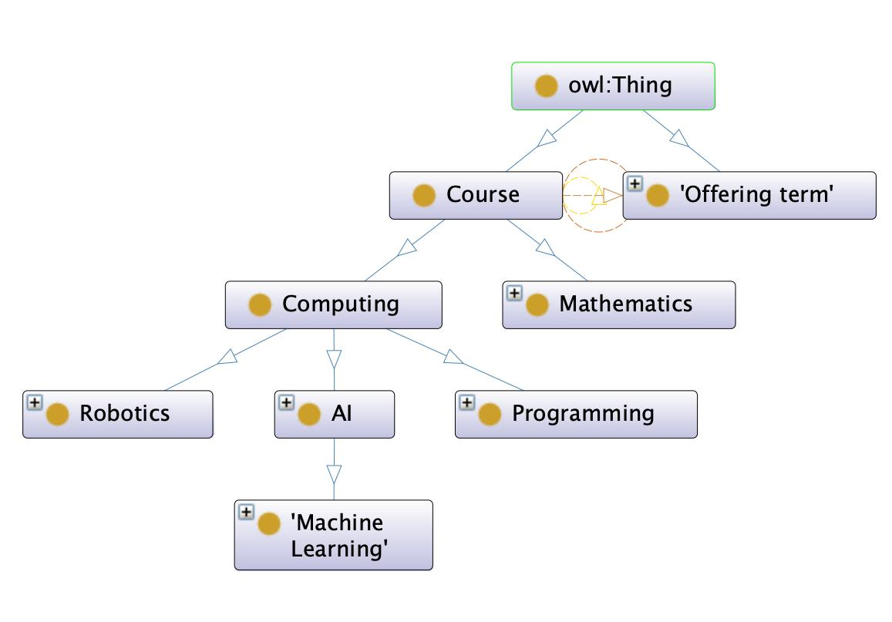
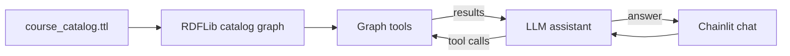

# Ontology-grounded course advisor

An educational chatbot for **fictional Cedar University**, with a catalog of
20 courses in programming, mathematics, AI, machine learning, and robotics.
Ask about course details, offering terms, and prerequisites through a Chainlit
chat interface.

The [catalog Turtle file](data/course_catalog.ttl) contains both the ontology
and the course instances. The ontology defines course categories, offering
terms, and properties such as names, credits, and prerequisites. The instances
provide each course's details and relationships using that vocabulary.

Categories form a subclass hierarchy: Computing includes Programming, Robotics,
and AI; AI includes Machine Learning, which includes Deep Learning. Offering
terms are Fall, Spring, and Summer.



RDFLib loads this knowledge graph, and graph traversal finds indirect
prerequisites and parent categories. For example, Algorithms requires Data
Structures, which requires Object-Oriented Programming, which requires
Introduction to Programming. Following the category hierarchy also includes
Deep Learning when searching for AI courses.

Four tools let the chatbot query the catalog and traverse its relationships:

| Tool | Input | What it does |
| --- | --- | --- |
| `list_courses` | Optional category and offering term | Lists matching course IDs and names. Category searches include subclasses, so an AI search also finds Machine Learning and Deep Learning courses. Term searches match recorded offerings. |
| `get_course_details` | Course ID or name | Returns the course's description, credits, categories, offering terms, and direct prerequisites. Missing offering terms are reported as unknown. |
| `get_prerequisites` | Course ID or name | Finds direct and indirect prerequisites and returns the relationships that explain each prerequisite chain. |
| `check_prerequisites` | Target course and completed course IDs | Compares all direct and indirect requirements with the supplied completed courses, returning satisfied and missing requirements and whether all prerequisites are satisfied. |

Course lookups also accept unique name fragments; ambiguous names prompt
clarification. Prerequisite checks use the completed courses you explicitly supply.

LangGraph connects the LLM to these tools. For each question, the model selects
the tools it needs, receives graph results, and explains them in the Chainlit
chat interface.



## Project structure

```text
.
├── app.py                    Chainlit entry point, chat events, and session history
├── src/                      Chatbot and knowledge graph logic
│   ├── __init__.py           Python package marker
│   ├── kg.py                 Catalog loading, course lookup, and graph traversal
│   ├── tools.py              Four graph tools available to the LLM
│   └── agent.py              LLM configuration, instructions, and LangGraph workflow
├── data/                     Knowledge graph data
│   └── course_catalog.ttl    Catalog ontology and course instances
├── img/                      README images
│   └── ontology.jpg          Catalog ontology visualization
├── .chainlit/                Chat interface configuration
│   └── config.toml           Chainlit settings
├── .env.example              API key and model configuration template
├── requirements.txt          Python dependencies
├── chainlit.md               Welcome content displayed in the chat interface
├── .gitignore                Git ignore rules
└── README.md                 Project overview and running instructions
```

## Setup and run

Use **Python 3.11 or newer**. Run these commands from the project root:

```bash
python3 -m venv .venv
source .venv/bin/activate
python -m pip install -r requirements.txt
cp .env.example .env
```

Set your OpenAI API key and model in `.env`:

```dotenv
OPENAI_API_KEY=your-openai-api-key-here
OPENAI_MODEL=gpt-4.1-mini
```

Choose a model your API account can access that supports tool calling through
the Responses API. Start the app:

```bash
chainlit run app.py
```

Open [localhost:8000](http://localhost:8000) to chat. Expand the tool steps to
inspect the queries and graph results behind each answer. Restart the app after
changing `.env`.

## Example questions

Try these questions in one chat:

1. “Tell me about Algorithms: its credits, offering terms, and direct prerequisites.”
2. “List the AI courses. Why is Deep Learning included?”
3. “What are the direct and indirect prerequisites for Algorithms? Explain the chain.”
4. “For Deep Learning, I have completed CS101, MA102, MA201, and ML201. Which prerequisites are satisfied and which are missing?”
   The missing requirements are MA101 (Calculus) and MA202 (Optimization).
5. “And if I also completed those two missing courses?”
6. “Is Autonomous Robotics offered in Spring?”
   Its offering terms are not recorded in the catalog, so availability is unknown.
