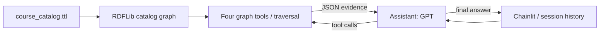

# Ontology-grounded course advisor

A small educational chatbot for **fictional Cedar University**, designed for a
20-minute tutorial. Ask about 20 courses by name, inspect the tool evidence, and
see how graph traversal finds parent categories and indirect prerequisites.
The catalog covers programming, mathematics, AI, machine learning, and robotics.

## What each part does

- **Ontology:** the classes and properties at the top of the Turtle file define
  the catalog's vocabulary, category hierarchy, and relationship semantics.
- **Instance knowledge graph:** the rest of that file records the 20 courses,
  names, descriptions, credits, offering terms, and mandatory direct requirements.
- **Traversal:** Python follows recorded prerequisite edges and RDFLib follows
  `rdfs:subClassOf` edges to parent categories. There is one graph; derived results
  are returned on demand without adding triples or running an OWL reasoner.
- **Tools:** four fixed queries/traversals turn graph facts into compact JSON.
  The model selects tools and arguments; it never writes arbitrary SPARQL.
- **LLM:** a GPT model interprets the question and explains tool results.
- **Chainlit:** displays the answer and tool names, arguments, and results, with
  conversation history kept in each chat session.



## Catalog design

Project namespace: `https://example.org/course-advisor#`. Course IDs are stable
local names such as `CS101`; `courseId` also stores the human-facing ID. Categories
are RDF classes. Courses assert their specific category, rather than asserting
all of its ancestors:

```text
Course
├── MathematicsCourse
└── ComputingCourse
    ├── ProgrammingCourse
    ├── RoboticsCourse
    └── AICourse
        └── MachineLearningCourse
            └── DeepLearningCourse
```

There are four courses in each of the five catalog sections. `ML301` has the
specific category `DeepLearningCourse`. This makes the **AI** filter include all
eight AI/ML courses by traversing the subclass hierarchy; category results overlap.

`hasDirectPrerequisite` records the original edges. It is a subproperty of the
OWL transitive `hasPrerequisite` in the ontology. These declarations describe the
vocabulary; the application computes requirements by following the recorded
direct edges. It does not materialize `hasPrerequisite` triples. Direct requirements
are immediate neighbors; indirect requirements are reachable courses excluding
those immediate neighbors.
The graph is acyclic, with chains such as
`CS202 → CS201 → CS102 → CS101` (arrow means **requires**), and courses such as
`ML301` with multiple mandatory requirements. No optional prerequisite rules or
alternative combinations are modeled.

Offering terms use `OfferingTerm` individuals: Fall, Spring, and Summer.
`AI301` (Natural Language Processing) and `RB301` (Autonomous Robotics)
deliberately have no offering-term statements. Missing means **unknown**.
Even for other courses, recorded terms are not a complete real-time schedule;
an absent Spring statement does not prove a course is unavailable in Spring.
An empty prerequisite list means none recorded in this simplified catalog.

## Files

```text
data/course_catalog.ttl   ontology and exactly 20 course individuals
kg.py                     one catalog graph, name resolution and traversal
tools.py                  four typed LangChain tools
agent.py                  assistant / ToolNode loop and grounding prompt
app.py                    Chainlit events, session history, visible tool I/O
chainlit.md               short welcome panel with a sample question
requirements.txt          compatible pinned direct dependencies
.env.example              GPT environment-variable placeholders
.gitignore                excludes secrets, virtual environment and generated files
.chainlit/config.toml     app name and tool-only step display
README.md                 setup and tutorial walkthrough
```

The LangGraph has two nodes: `assistant` and `tools`. `tools_condition` sends
assistant tool calls to `ToolNode`; tools return to the assistant. A response
without tool calls ends the turn. `MessagesState` accumulates messages during
the run. Chainlit stores user, assistant, and tool messages in `user_session`
and supplies that history on the next turn. A new chat starts with fresh history.
There is no persistent database or cross-session conversation memory.

Only tool steps and the final text answer are sent to the UI. Model reasoning
content is not displayed. The integration uses `ChatOpenAI` with the Responses
API and `bind_tools`, with no custom retries or additional agent layers.

## Setup and run

Use **Python 3.11 or newer** (verified with Python 3.12). Run from the project root.
On macOS/Linux, use `python3.12` below if `python3` selects an older system Python.

```bash
python3 -m venv .venv
source .venv/bin/activate
python -m pip install -r requirements.txt
cp .env.example .env
```

Edit `.env`:

```dotenv
OPENAI_API_KEY=your-openai-api-key-here
OPENAI_MODEL=gpt-4.1-mini
```

Replace the key with a real OpenAI API key and choose a GPT model your API
account can access that supports function calling through the Responses API.
`gpt-4.1-mini` is the example model, not a requirement. Both variables are read
from the environment; `.env` supplies them locally without overwriting existing
environment variables. `.env` is ignored by Git. API usage requires an API
account with access to the chosen model.

```bash
chainlit run app.py
```

Open `http://localhost:8000`. The UI can launch without credentials and displays
a setup message. Actual chat answers require both environment variables; restart
Chainlit after changing them. Local graph tools need no key.

If your shell defines `DEBUG` as a non-boolean value, Chainlit's CLI rejects it.
Use `DEBUG=false chainlit run app.py` in that shell (this was needed in the
verification environment).

## The four tools

| Tool | Arguments | Result |
| --- | --- | --- |
| `list_courses` | Optional `category`, `term` | IDs/names, available categories/terms, and membership marked `asserted` or `subclass_traversal`. Term filters use recorded offerings only. |
| `get_course_details` | `course` | Asserted name, description, integer credits, specific categories, recorded terms or unknown status, and direct requirements. |
| `get_prerequisites` | `course` | Separate direct and indirect sets, plus reachable asserted edges that explain the chains. |
| `check_prerequisites` | `course`, `completed_course_ids` | Satisfied/missing full requirements, completion-record assumption, and supporting relationships. |

`course` accepts a case-insensitive ID, exact name, or unique name fragment.
Ambiguous fragments return candidate IDs/names so the chatbot can ask a brief
clarifying question. `list_courses` lets it discover IDs and resolve completed
course names. Categories accept class keys such as `AICourse` or labels such as
`AI` and `Machine Learning`; unknown filters return available choices.

For prerequisite checks, the supplied completed list is the **complete record
for this demonstration**. The chatbot asks for that list when it is missing.
An explicit empty list is allowed. Completing an advanced course does not mark
its prerequisites completed if they were not listed. Every requirement is
mandatory, including indirect ones. The tool checks prerequisite satisfaction
only; it does not decide enrollment eligibility, capacity, grades, or policies.

## Direct and derived examples

Presentation-ready diagrams of these examples are available in
[`figures/`](figures/README.md), with matching recorded/traversed views and a class
hierarchy view. Each has a 16:9 PNG and editable SVG export. The optional renderer
uses Matplotlib and does not add a dependency to the chatbot itself.

**Direct fact:** `CS202` (Algorithms) has 4 credits, a recorded Spring offering,
and the direct prerequisite `CS201` (Data Structures).

**Derived results:** `CS202` also requires `CS102` and `CS101`, through
`CS202 → CS201 → CS102 → CS101`. Traversal returns those indirect requirements
and their supporting direct edges. It does not add shortcut triples to the graph.
Separately, `ML301` (Deep Learning) is retrieved under AI because
`DeepLearningCourse → MachineLearningCourse → AICourse` is a subclass chain.

Try the tools directly, without using an API key:

```bash
python - <<'PY'
from pprint import pprint
from tools import get_course_details, get_prerequisites, list_courses

pprint(get_course_details.invoke({"course": "Algorithms"}))
pprint(get_prerequisites.invoke({"course": "CS202"}))
pprint(list_courses.invoke({"category": "AI"}))
PY
```

## Suggested 20-minute video

| Time | Walkthrough |
| --- | --- |
| 0–2 min | Explain the task and show the small file structure. |
| 2–6 min | Open the Turtle ontology, class hierarchy, 20 instances, and direct prerequisite edges. Point out the two missing offering terms. |
| 6–9 min | Show `kg.py`: one graph, prerequisite traversal, and parent-category traversal. Run the direct tool examples above and inspect direct/indirect requirements. |
| 9–12 min | Walk through the four tools and their JSON evidence. Show name resolution and the completion-record assumption. |
| 12–15 min | Show `agent.py` and the assistant/tools loop, then `app.py` session history and visible steps. |
| 15–19 min | Launch Chainlit and use the questions below, expanding tool steps to inspect arguments and results. |
| 19–20 min | Recap evidence, unknown information, and the limits of prerequisite checks and LLM grounding. |

Use this sequence in one chat:

1. **Details:** “Tell me about Algorithms: its credits, recorded terms, and direct prerequisites.”
2. **Subclass discovery:** “List the AI courses. Why is Deep Learning included?”
3. **Prerequisite traversal:** “What are the direct and indirect prerequisites for Algorithms? Explain the chain.”
4. **Completion check:** “For Deep Learning, I have completed CS101, MA102, MA201, and ML201. Which prerequisites are satisfied and which are missing?”
   Expected missing requirements: `MA101` (Calculus) and `MA202` (Optimization).
5. **Follow-up:** “And if I also completed those two missing courses?”
   The chatbot should use the preceding list and return all prerequisites satisfied,
   while stating the complete-record assumption and limited scope.
6. **Missing information:** “Is Autonomous Robotics offered in Spring?”
   Expected interpretation: offering terms are not recorded; Spring availability is unknown.

Optional quick examples:

- “Which programming courses have a recorded Fall offering?” (`CS101`, `CS201`.)
- “Tell me about the robot course.” (Ambiguous: ask which robotics course.)
- “Do I satisfy the prerequisites for Computer Vision?” (Ask for completed courses.)
- “I have completed no courses. Do I satisfy the prerequisites for Introduction to Programming?”

## Verification and limits

Implementation verification passed on Python 3.12: catalog and traversal checks,
dependency compatibility check, and Chainlit launch. The local server returned
HTTP 200 for the UI and project settings, and a real Socket.IO chat connection
received the setup message when GPT credentials were absent. Agent construction
and binding all four tool schemas were also checked without making API requests.
Live GPT conversations were not tested during the traversal refactor.

Grounding supplies evidence but **does not guarantee perfect LLM answers**.
The model can choose the wrong tool, misunderstand a follow-up, or summarize a
result incorrectly. Inspect the visible tool evidence when evaluating answers.
This is a tutorial catalog, not a real university enrollment system. The prompt
guides clarification and factual answers; it is not a formal guarantee.

Live GPT response quality and API access must be verified with your own key.
The catalog, traversals, tools, and UI can be verified independently.

The APIs used here were checked against the primary documentation:
[OpenAI function calling](https://developers.openai.com/api/docs/guides/function-calling),
[ChatOpenAI integration](https://docs.langchain.com/oss/python/integrations/chat/openai),
[LangGraph tool workflow](https://docs.langchain.com/oss/python/langgraph/workflows-agents),
[Chainlit steps](https://docs.chainlit.io/api-reference/step-class),
[Chainlit sessions](https://docs.chainlit.io/concepts/user-session).
